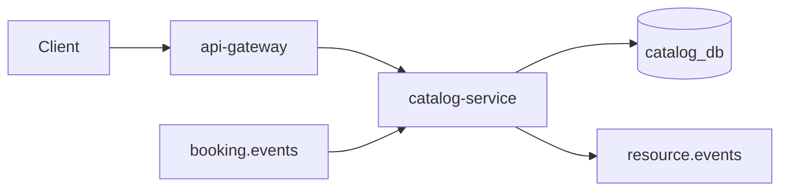

# catalog-service

Library resource catalog (seats, rooms, equipment) for the [Library Booking System](https://github.com/LibraryBookingSystem/Documentation). Serves filtered search and admin CRUD, publishes `resource.events`, and listens to **booking** events to keep availability aligned without coupling every read to booking-service.

## Role in the system



## API (via gateway)

Base path: `http://localhost:8080/api/resources`

| Method | Path | Description |
| --- | --- | --- |
| GET | `/` | List resources (`type`, `floor`, `status`, `search`) |
| GET | `/{id}` | Resource by id |
| POST | `/` | Create resource (admin) |
| PUT | `/{id}` | Update resource (admin) |
| DELETE | `/{id}` | Delete resource (admin) |
| GET | `/health` | Health check |

## Stack

- Java 17, Spring Boot 3.5
- JPA (PostgreSQL), AMQP, Spring Security, AOP, JJWT
- [common-aspects](https://github.com/LibraryBookingSystem/common-aspects)

## Configuration

| Variable | Purpose |
| --- | --- |
| `DB_*` | PostgreSQL (`catalog_db` in Compose) |
| `RABBITMQ_*` | Consume booking events; publish resource events |
| `JWT_SECRET`, `JWT_EXPIRATION` | Protected routes |

HTTP port **3003**.

## Run locally

```powershell
cd docker-compose
docker compose up -d catalog-service
```

## Related repositories

- [booking-service](https://github.com/LibraryBookingSystem/booking-service) — reservations drive availability updates
- [realtime-gateway](https://github.com/LibraryBookingSystem/realtime-gateway) — live resource updates to clients
- [Documentation](https://github.com/LibraryBookingSystem/Documentation) — API reference
